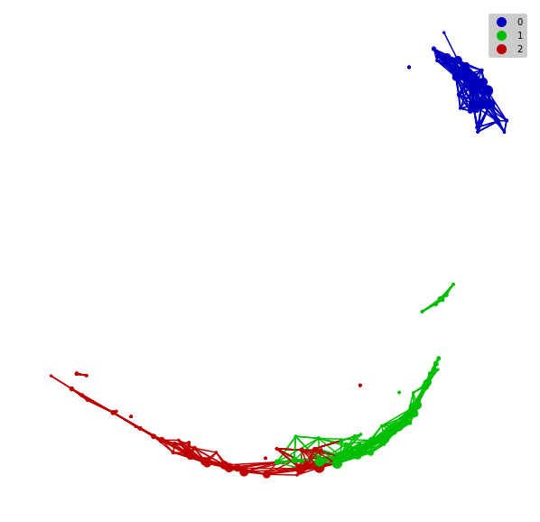
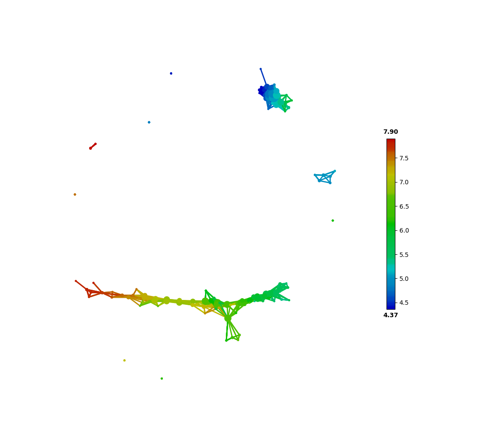
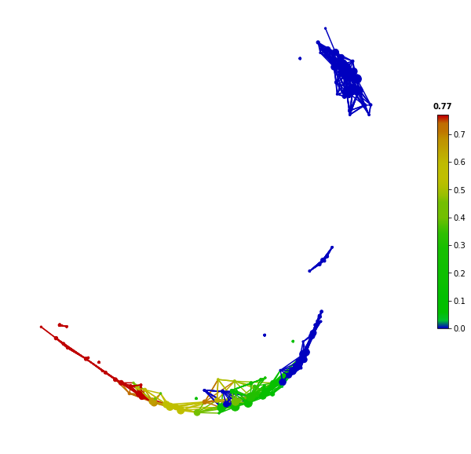

Basic Usage of *tmap*
############################

This guide is to help you start working with **tmap**.

High dimension and complex data are common in modern biological science, especially in omics studies. To successfully apply machine learning techniques in this scenario, we need to perform dimensionality reduction to have a lower dimensional representation of the data. The learned low-dimensional features can then be used for visualization or as input for regression / classification analysis.

**tmap** is a method which can be used to reduce high dimensional data sets into simplicial complexes with far fewer representative data points (as nodes in a TDA network), which capture topological information (" the shape of data") at a specified resolution.

Let's start a **tmap** analysis by using a simplest case, to get you familiar with the basic steps and the overall workflow.

A Simple Case
===================

Using the classical *iris* dataset as a simple example. This case is use to demonstrate the general usage of **tmap** with simplicity in mind. The same approach can also be applied to microbiome data analysis, which will be demonstrated in this documentation.

.. code-block:: python

    from sklearn import datasets

    iris = datasets.load_iris()
    X = iris.data

Once we have prepared input data (in *pandas DataFrame* or a *numpy matrix*), we can proceed to initiate the basic instances for TDA analysis, including ``Mapper``, ``filter``, ``cluster`` and ``Cover``.

.. code-block:: python

    from tmap.tda import mapper, filter
    from tmap.tda.cover import Cover

    # Step1. initiate a Mapper
    tm = mapper.Mapper(verbose=1)

    # Step2. Projection
    lens = [filter.MDS(components=[0, 1])]
    projected_X = tm.filter(X, lens=lens)
    clusterer = DBSCAN(eps=0.75, min_samples=1)
    cover = Cover(projected_data=MinMaxScaler().fit_transform(projected_X), resolution=20, overlap=0.75)

After preparing the required instances and input data, the ``map`` function of the ``Mapper`` object can be called to return a TDA graph (or TDA network). A *graph* is a collection of nodes (vertices) along with identified pairs of nodes (edges). For now, we use nest dictionary as a container to store all the information of a TDA graph, which will be used for TDA network visualization and statistical analysis.

.. code-block:: python

    graph = tm.map(data=StandardScaler().fit_transform(X), cover=cover, clusterer=clusterer)

The generated graph consists of 201 nodes and 1020 edges, which can be obtained by:

.. code-block:: python

    print(len(graph['nodes']),len(graph['edges']))

    201 1020

Each node represents a group of samples, generated from the clustering step. Mapping between TDA nodes and samples can be found by:

.. code-block:: python

    print(graph['nodes'].items())
    (0, array([ 718, 1655, 2564, 2846, 3946, 4431])),
    (1, array([  69,  616,  853, 1266, 1575, 1833, 1959, 2268, 3635])),
    (2, array([  28,  350,  511,  601,  616,  629,  723, 1162, 1193, 1266,
      1300,1424, 1536, 1634, 1841, 1868, 1943, 2268, 2282, 2719, 2898,
      2929,3300, 3605, 3634, 3763, 3816, 3848, 4461, 4828])),
    (3, array([   1,  669,  692,  814, 1064, 1424, 1435, 1503, 1512, 1909, 2145,
      2182, 2412, 2786, 2840, 2849, 2929, 3132, 3162, 3179, 3414, 3439,
      3541, 3667, 3708, 3759, 4038, 4168, 4170, 4176, 4478, 4497, 4606,
      4938, 4974])),
    ......

As above, keys in the returned items are node IDs, and the values are sample index in the original input data.

Using Different Distance Metric
========================================

After introducing the basic usage of **tmap**, we now delve into the details of each class. We may want to use a different distance metric instead of the default (*Euclidean*) distance metric. Particularly in microbiome data analysis, the weighted or unweighted UniFrac distance metric can be used.

For using custom distance metric from a precomputed distance matrix, you need to set the `metric` parameter as **"precomputed"** when initiating a ``filter`` object.

.. code-block:: python

    from scipy.spatial.distance import pdist,squareform
    lens = [filter.MDS(components=[0, 1],metric='precomputed')]
    my_dist = squareform(pdist(X,metric="braycurtis"))
    projected_X = tm.filter(my_dist, lens=lens)

A ``filter`` is a general technique to project data points from the original data space onto a low dimensional space. Different filter preserves different aspect of the original dataset, such as MDS, which try to preserve distances between data points. Therefore, a ``filter`` provides a *view* of the data to look through. Multiple *views* can be joined to present the data for topological analysis. Choice of filter depends on the studied dataset and research purpose. Projection of the original dataset using a specified filter has a global effect in determining the TDA network structure.

Different filters can be generated and combined into a ``lens`` using a Python list, and within each filter, different components can be specified with a index list. There are various filters implemented in the `filter` module, including PCA, MDS, and t-SNE. More filters can be easily incorporated using the defined APIs.

TDA Network Visualization and Coloring
======================================================

After constructing a TDA graph, it is very useful and insightful to visualize the network for pattern discovery.
We built wrapper classes around `networkx` and `matplolib` to facilitate TDA network visualization for different target features using a specified color mapping object.

.. code-block:: python

    from tmap.tda.plot import show, Color
    y = iris.target
    color = Color(target=y, dtype="categorical")
    show(data=X, graph=graph, color=color, fig_size=(10, 10), node_size=15, mode='spring', strength=0.04)

Depending on the type of target data, there are two types of color mappings (``categorical`` or ``numerical``) we can choose. If we have a binary/continuous numeric feature, we recommend using the ``numerical`` type to show a '*node averaged*' distribution of the target feature among the network. For a binary feature, the value of a node indicates the ratio of ``True`` among all samples in the node for the feature.
For a multi-classes feature, you should use the ``categorical`` type to visualize the most-abundant category for each node. As an alternative, you can also use the *One-Hot encoding* method to transform a multi-classes feature into multiple binary features and then examine them individually using a ``numerical`` color map.

Network Enrichment and the SAFE score
======================================================

After obtaining a TDA graph, we can explore network structures associated with the dataset and perform network based statistical analysis. One straightforward way is to use network enrichment analysis to understand how a target feature is enriched locally with a subset of nodes and groups of samples, or how the target feature vary among the whole network to have a global picture.
We adopted the SAFE (Spatial Analysis of Functional Enrichment) algorithm for the calculation of a SAFE score for each node, given a specified target feature. Target feature can be a dependent variable for a supervised learning task, or can be a independent variable to identify the most distinctive attributes for a group of samples in the network.

First, we plot and color the first feature (``sepal length``) of the iris dataset on the TDA network.

.. code-block:: python

    color = Color(target=X[:,0], dtype="numerical")
    show(data=X, graph=graph, color=color, fig_size=(10, 10), node_size=15, mode='spring', strength=0.04)

From the above figure, feature coloring shows that ``sepal length`` is strongly associated with the network structure (range of the ``sepal length`` values and their color mapping are indicated by the color legend on the right-hand side). Then we can use the SAFE algorithm to transform the raw feature values to network-based statistical scores (log10-transformed p-values).

.. code-block:: python

    from tmap.netx.SAFE import *
    safe_scores = SAFE_batch(graph, meta_data=X, n_iter=1000, threshold=0.05)
    color = Color(target=safe_scores[X.columns[0]], dtype="numerical")
    show(data=X, graph=graph, color=color, fig_size=(10, 10), node_size=15, mode='spring', strength=0.04)

Instead of coloring based on original feature value, the SAFE score colors can help to reveal significantly enriched nodes in the network, which can be extracted for further analysis. Regarding the details of the SAFE algorithm and SAFE score, please see :doc:`how2work`.

SAFE Statistical Summary
===============================

In addition to the use of SAFE score for feature coloring and visualization, various network enrichment statistics can be calculated and summarized for each target feature, based on the SAFE algorithm. These statistics are useful for ranking and filtering of significant features associated with the TDA network, together with their strength of association/enrichment. The selected features are expected to explain the network structure, and therefore '*the shape of data*'.

.. code-block:: python

    from tmap.netx.SAFE import get_SAFE_summary

    safe_summary = get_SAFE_summary(graph=graph, meta_data=X, safe_scores=safe_scores,
                                    n_iter_value=1000, p_value=0.01)

In the above code, a p-value threshold of ``0.01`` was set to select significant nodes for the calculation of ``SAFE enriched score`` and ``enriched SAFE score ratio``, which can be used to rank the importance and filter the significance of features associated with the TDA network. For more details on SAFE summary, please see :doc:`how2work`.

Network-based Association Analysis
=========================================

Rather than analyzing each feature individually, by testing their association/enrichment with TDA network, we can also examine relationships between features, given an underlaying 'shape of data'. A straightforward approach is to perform a standard correlation analysis (such as Pearson correlation) based on the SAFE scores, rather than the original values. It is worth noting that, this network-based association analysis treating each node as an observation, instead of taking each sample (original data point) as an observation.

With SAFE scores and a corresponding TDA graph, *p-value* and *correlation coefficient* of each pair of features are calculated by Pearson's correlation and corrected by FDR (Benjamini/Hochberg) correction.

.. code-block:: python

    asso_pairs = coenrich(graph,safe_scores)

    print(asso_pairs)
