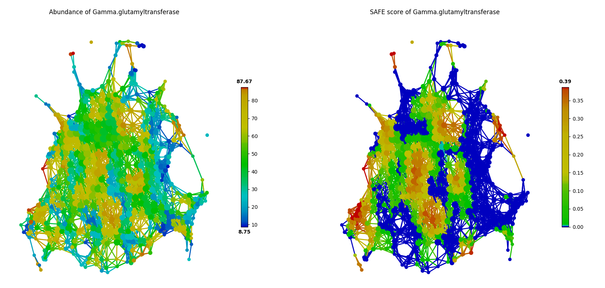
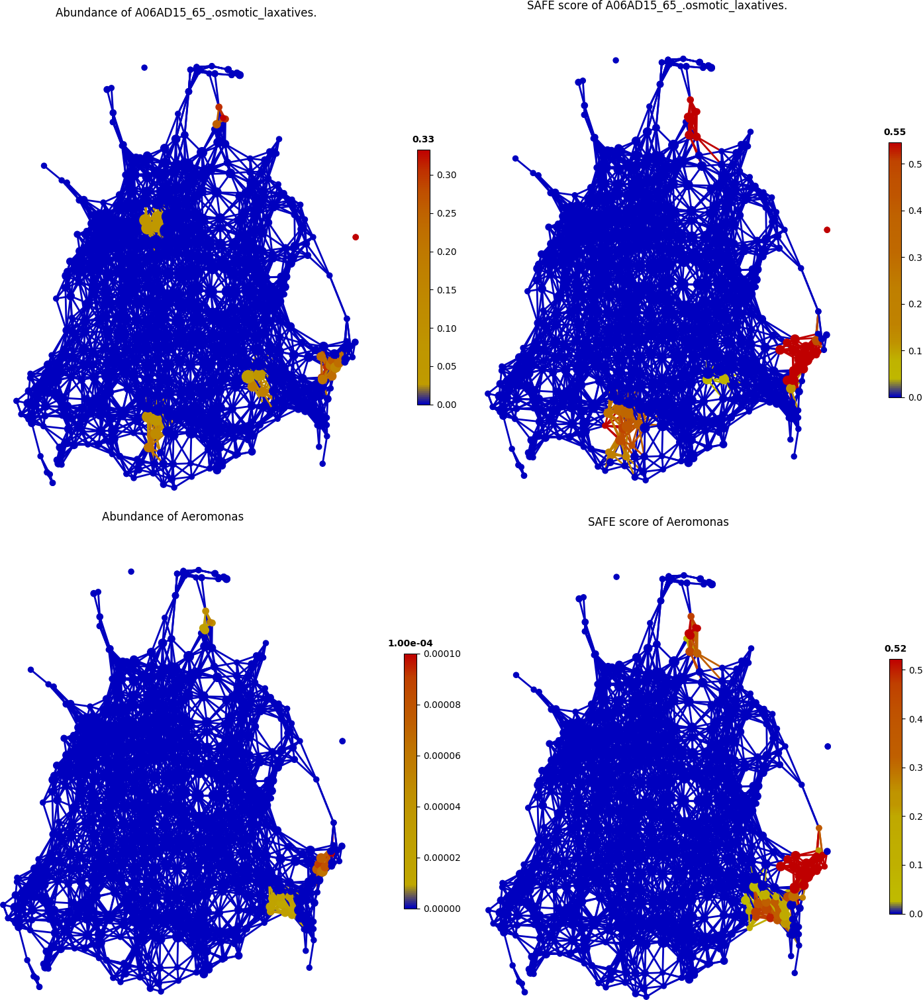
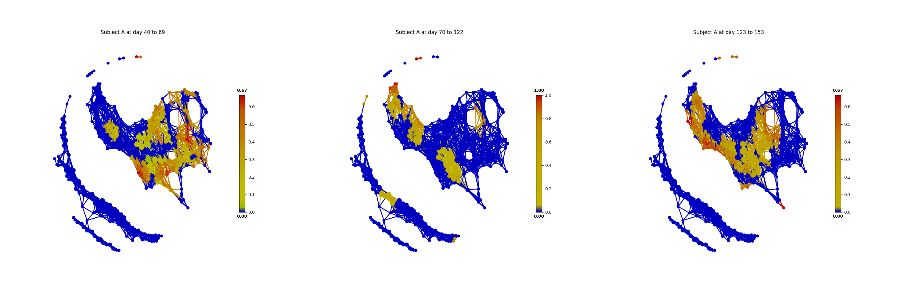
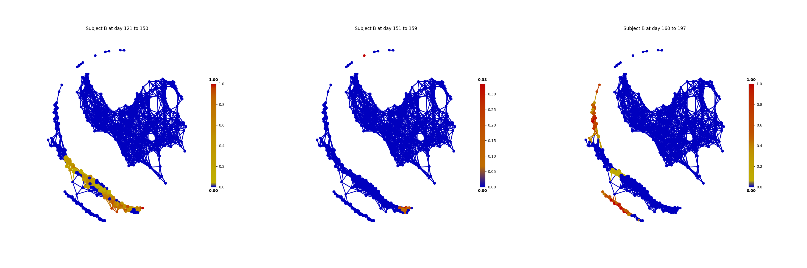

Microbiome Examples
#########################

Analyzing the population-scale FGFP microbiome dataset
==============================================================

To demonstrate and validate the performance of *tmap*, we benchmarked the result from `'Population-level analysis of gut microbiome variation' <https://www.ncbi.nlm.nih.gov/pubmed/27126039>`_ (abbreviated as **FGFP study** below). [Ref4]_ *tmap* was applied to re-analyze the driver species of human gut microbiota, significant microbiome covariates from metadata and the interaction between driver genera and covariates.

.. code-block:: python

    from __future__ import print_function
    from sklearn.preprocessing import MinMaxScaler
    from sklearn.cluster import DBSCAN
    from tmap.tda import mapper, filter
    from tmap.tda.cover import Cover
    from tmap.tda.plot import show, Color
    from tmap.tda.metric import Metric
    from tmap.tda.utils import optimize_dbscan_eps,cover_ratio
    from tmap.netx.SAFE import SAFE_batch, get_SAFE_summary
    from tmap.test import load_data
    import os

    # load taxa abundance data, sample metadata and precomputed distance matrix
    X = load_data.FGFP_genus_profile()
    metadata = load_data.FGFP_metadata()
    dm = load_data.FGFP_BC_dist()

    # TDA Step1. initiate a Mapper
    tm = mapper.Mapper(verbose=1)

    # TDA Step2. Projection
    metric = Metric(metric="precomputed")
    lens = [filter.MDS(components=[0, 1], metric=metric,random_state=100)]
    projected_X = tm.filter(dm, lens=lens)

    # Step4. Covering, clustering & mapping
    eps = optimize_dbscan_eps(X, threshold=95)
    clusterer = DBSCAN(eps=eps, min_samples=3)
    cover = Cover(projected_data=MinMaxScaler().fit_transform(projected_X), resolution=50, overlap=0.75)
    graph = tm.map(data=X, cover=cover, clusterer=clusterer)
    print('Graph covers %.2f percentage of samples.' % cover_ratio(graph,X))

Driver species analysis
==============================

In FGFP study, driver genus was identified by the contribution of each genus to microbiome variation via Canonical correspondence analysis (**CCA**) using both raw and normalized genus abundance. In our re-analysis, we identified driver genus by ranking the importance of a genus by its SAFE enrichment score with *tmap*. This approach successfully recovered all the top-10 driver genera reported in the FGFP study.

*tmap* also identified 3 driver genera that were not reported in the FGFP study, including *unclassified_Veillonellaceae, unclassified_Clostridiaceae and Sporobacter*. As in the following figure of *tmap* network visualization, these genera (such as *Sporobacter spp.*) show enrichments in multiple dispersed parts of the network, rather than a single enriched component, which presents a 'non-linear' pattern that may be hard to detect in CCA.

Identification of significant host covariates
=============================================================

The FGFP study identified host covariates of microbiome variation by calculating the association between host factors and genus-level community ordination with the *envfit* function in the *vegan* R package. The *envfit* function preforms *MANOVA* and linear correlation for categorical and continuous variables, respectively. In total, 69 out of 503 host factors were identified as covariates of gut microbiome using FDR<0.1, and 43 among them were considered as significant covariates when using FDR<0.05 as a cut-off.

Since *tmap* was robust to identify both linear and non-linear associations, 67 out of 503 host factors were identified as significant covariates with FDR<0.05. Compared to the original FGFP study, *tmap* successfully identified 41 out of the 43 formerly detected covariates, and also identified 26 new covariates.

The two covariates reported as significant in the FGFP study but not identified by *tmap* are *G03DA04_progesterone* and *Gamma-glutamyltransferase*. As shown in the following figures, it can be found that, *G03DA04_progesterone* was observed only in a small group of samples, and is not significant (SAFE score < 0.67) after SAFE transformation due to the small sample size.

.. image:: img/example/FGFP_fig2.png
    :alt: FGFP G03DA04_progesterone

In contrast, *Gamma-glutamyltransferase* was observed in most of the samples as in the following figure. But the network landscape (SAFE scores) of this factor did not show significant patterns of enrichment (SAFE score < 0.67).

Microbiome-wide association of FGFP host covariates
=============================================================

In FGFP study, *the boosted additive generalized linear model* was performed to analyze association between host covariates and driver species, with a 5% significance level (after adjustment for multiple comparison). However, this approach reported small effect sizes for covariates to explain the variation of genus abundance (correlation coefficient from 0.015 to 0.147).

As an alternative, *tmap* uses the network-based SAFE scores for association analysis, rather than the original feature values. And association is performed based on aggregated values on nodes (groups of samples), instead of original feature values on samples. Pairwise Pearson correlation was calculated with a FDR<5% significance level. Compared with results of the FGFP study, this approach reported improved effect sizes of host covariates (correlation coefficient from 0.115 to 0.728). For example, the association between *concentration of serum Hemoglobin* and abundance of *Roseburia spp.*, detected to be significantly associated by both approaches, the coefficient was improved from 0.12 to 0.72 by using *tmap*.

Additionally, new associations were also identified by *tmap*. For example, the association between usage of *A06AD15_65_.osmotic_laxatives* and abundance of *Aeromonas spp.* was found, as demonstrated in the following figure.

Analyzing the human microbiome from a daily timescales study
===============================================================

*tmap* can be used in time-series study of human microbiome, such as the daily timescales study by `David et al. <https://www.ncbi.nlm.nih.gov/pubmed/25146375>`_. This study collected daily fecal and salivary samples from two individuals to analyze how lifestyle affects the dynamics of human microbiota. With *tmap*, we can visualize how timescales are mapped to the landscape of microbiome of a subject to discover hidden patterns in personal microbiome dynamics. [Ref5]_

More details about the codes used in this analysis can be found at ``test/test_Daily_saliva.py`` and ``test/test_Daily_stool.py``.

.. code-block:: python

    from __future__ import print_function
    from sklearn.preprocessing import MinMaxScaler
    from sklearn.cluster import DBSCAN
    from tmap.tda import mapper, filter
    from tmap.tda.cover import Cover
    from tmap.tda.plot import show, Color
    from tmap.tda.metric import Metric
    from tmap.tda.utils import optimize_dbscan_eps,cover_ratio
    from tmap.netx.SAFE import SAFE_batch, get_SAFE_summary,SAFE_single
    from tmap.test import load_data
    from matplotlib.pyplot import title
    from scipy.spatial.distance import pdist,squareform

    # load taxa abundance data, sample metadata and precomputed distance matrix
    X = load_data.Daily_genus_profile("stool")
    X = X.drop("Stool69",axis=0)
    # Stool69 is missing at provided metadata. So deleted it
    metadata = load_data.Daily_metadata_ready()
    dm = squareform(pdist(X,metric="braycurtis"))
    metadata = metadata.loc[X.index,:]

    # TDA Step1. initiate a Mapper
    tm = mapper.Mapper(verbose=1)

    # TDA Step2. Projection
    metric = Metric(metric="precomputed")
    lens = [filter.MDS(components=[0, 1], metric=metric,random_state=100)]
    projected_X = tm.filter(dm, lens=lens)

    # Step4. Covering, clustering & mapping
    eps = optimize_dbscan_eps(X, threshold=99)
    clusterer = DBSCAN(eps=eps, min_samples=3)
    cover = Cover(projected_data=MinMaxScaler().fit_transform(projected_X), resolution=50, overlap=0.85)
    graph = tm.map(data=X, cover=cover, clusterer=clusterer)
    print('Graph covers %.2f percentage of samples.' % cover_ratio(graph,X))

.. code-block:: python

    Filtering by MDS.
    ...calculate distance matrix using the precomputed metric.
    Finish filtering of points cloud data.
    Mapping on data (501, 98) using lens (501, 2)
    ...minimal number of points in hypercube to do clustering: 3
    ...create 474 nodes.
    ...calculate projection coordinates of nodes.
    ...construct a TDA graph.
    ...create 3313 edges.
    Finish TDA mapping
    Graph covers 91.22 percentage of samples.

First, we take the metadata of ``COLLECTION_DAY`` as our target variable to be mapped to the microbiome TDA network.

.. code-block:: python

    target_feature = 'COLLECTION_DAY'
    color = Color(target=metadata.loc[:, target_feature], dtype="numerical", target_by="sample")
    show(data=X, graph=graph, color=color, fig_size=(10, 10), node_size=15, mode='spring', strength=0.03)

The following figure shows how the fecal microbiome changes with the ``COLLECTION_DAY`` for the two studied subjects.

.. image:: img/example/Daily_Stool_collection_day.png
    :alt: Daily microbiome COLLECTION_DAY

Next, we can map ``HOST_SUBJECT_ID`` to the TDA network to show inter-individual differences. In the following codes, the ``categorical`` type is used to show dominant ``subject ID`` for a node, which is a group of samples, and may contain different subjects. Or we can use a ``numerical`` type to show mean values of the target variable for each node.

.. code-block:: python

    target_feature = 'HOST_SUBJECT_ID'
    color = Color(target=metadata.loc[:, target_feature], dtype="categorical", target_by="sample")
    show(data=X, graph=graph, color=color, fig_size=(10, 10), node_size=15, mode='spring', strength=0.03)

    color = Color(target=metadata.loc[:, target_feature], dtype="numerical", target_by="sample")
    show(data=X, graph=graph, color=color, fig_size=(10, 10), node_size=15, mode='spring', strength=0.03)

.. image:: img/example/Daily_host_compare.png
    :alt: Daily microbiome HOST_SUBJECT_ID

The main focus of the original study is to associate changes in microbiome with changes in lifestyle. In the study, Subject A left the USA on day 70 and returned on day 122. He suffered from diarrheal illnesses from day 80 to day 85, and from day 104 to day 113. Subject B suffered from a enteric infection from days 151 to 159.

.. code-block:: python

    def time_range(sample,start,end):
        target_vals = [1 if metadata.loc[_,"HOST_SUBJECT_ID"]=="2202:Donor%s" % sample and metadata.loc[_,"COLLECTION_DAY"] in list(range(start,end+1)) else 0 for _ in X.index]
        color = Color(target=target_vals, dtype="numerical", target_by="sample")
        show(data=X, graph=graph, color=color, fig_size=(10, 10), node_size=15, mode='spring', strength=0.03)
        title("Subject %s at day %s to %s" % (sample,start,end))
    # Travel period
    time_range("A",70,123)
    # First diarrheal illness
    time_range("A",80,85)
    # Second diarrheal illness
    time_range("A",104,113)

    # Pre-travel period
    time_range("A",40,69)
    # Travel period
    time_range("A",70,122)
    # Post-travel period
    time_range("A",123,153)

    # Pre-enteric infection period
    time_range("B",121,150)
    # enteric infection period
    time_range("B",151,159)
    # Post-enteric infection period
    time_range("B",160,197)

.. image:: img/example/Daily_Stool_A_diarrheal.png
    :alt: Daily_Stool_A_diarrheal

From the above figures, we could found that there are several changes in the microbiome of subject A between day 70 and day 122. It is worth noting that, the fecal microbiome samples of diarrheal illnesses at different time points are adjacent to each other in the network, and are overlap with shared nodes.  **Subject A’s travel-related microbiota shift** concluded in the original paper can be confirmed in this *tmap* re-analysis of the microbiome dataset. From the above figure, subject B's microbiome before and after the enteric infection is distinct, which is also consistent with the results of the original study.
