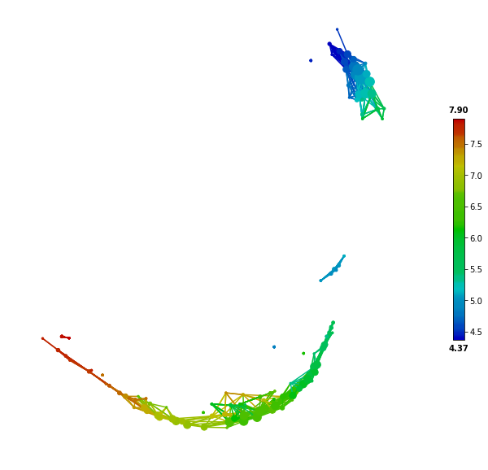

Visualizing and Exploring TDA Network
########################################

A TDA network is a powerful and compressive representation of a high dimensional complex dataset. Plotting the network provides a direct and insightful visualization of the underlying 'data shape', which can help to explore hidden patterns of the data. Nodes in the network correspond to groups of similar samples that have been clustered together. An edge between two nodes means that there are shared/common samples between the two nodes. Both large scale global structure and local group of nodes can be revealed in the network.

Furthermore, mapping a specified target variable onto the network, using a color scheme, can show how the target variable change along with the network. Therefore, plotting a TDA network and coloring the network with interested target variables is the first step to understand the analyzed data. In *tmap*, we can use the `Color` class to make a color scheme for a target variable. Then we can use the `show` function from `tda.plot` to visualize a TDA network, as demonstrated in the following codes:

.. code-block:: python

    from sklearn.preprocessing import MinMaxScaler, StandardScaler
    from sklearn import datasets
    from sklearn.cluster import DBSCAN
    from tmap.tda import mapper, Filter
    from tmap.tda.cover import Cover
    from tmap.tda.plot import show, Color,tm_plot,vis_progressX
    iris = datasets.load_iris()
    X = iris.data
    y = iris.target
    # Step1. initiate a Mapper
    tm = mapper.Mapper(verbose=1)
    # Step2. Projection
    lens = [Filter.MDS(components=[0, 1],random_state=100)]
    projected_X = tm.filter(X, lens=lens)
    projected_X = MinMaxScaler().fit_transform(projected_X)
    # Step3. Covering, clustering & mapping
    clusterer = DBSCAN(eps=0.75, min_samples=1)
    cover = Cover(projected_data=MinMaxScaler().fit_transform(projected_X), resolution=20, overlap=0.75)
    graph = tm.map(data=StandardScaler().fit_transform(X), cover=cover, clusterer=clusterer)

Network Plotting Without a Target Variable
====================================================================================

If we don't have a target variable, we could simply use `show` to visualize the network without any specified color map. The ``show`` function was implement with the **spring layout** of `networkx`_. After the version change into 2.+, it becomes weird. So we also implement a function called ``vis_progressX`` and simple api called ``tm_plot``, both functions are based on `plotly`_. .

By default, the network assigns all nodes with a default color tm_plot(graph,projected_X,mode='file',filename='vis_1.html')of **red**. More flexible color is implemented inside a class called ``Color`` and it need a suitable target value and corresponding parameters.

.. code-block:: python

    show(data=X, graph=graph, color='red', fig_size=(10, 10), node_size=15, mode='spring', strength=0.17)

.. image:: img/param/vis_1.png
    :alt: plot network default
    :align: center

.. code-block:: python

    # tm_plot(graph,projected_X,mode='file',filename='vis_1.html')
    # equal to
    # vis_progressX(graph,X,simple=True,mode='file',filename='_static/vis_1.html',include_plotlyjs='cdn')

.. raw:: html

    <iframe src="_static/vis_1.html" height="500px" width="100%"></iframe>

Network Plotting With a Target Variable
====================================================================================

Plotting a TDA network with a target variable is very helpful to understand how the variable changes along the network and how it distinguishes between nodes. We can first make a color map for a chosen target variable, and then pass it together with a TDA graph to the `show` function for network plotting.

The following codes use a "categorical" color type for a categorical variable, such as different classes of samples. With a "categorical" color type, a node is assigned a color according to its most common class of its samples.

.. code-block:: python

    color = Color(target=y, dtype="categorical")
    show(data=X, graph=graph, color=color, fig_size=(10, 10), node_size=15, mode='spring', strength=0.04)

.. image:: img/param/vis_2.png
    :alt: plot network with a target 1
    :align: center

.. code-block:: python

    # tm_plot(graph,projected_X, mode='file',filename='vis_2.html')
    # equal to
    # vis_progressX(graph,X,simple=True,color=color,mode='file',filename='_static/vis_1.html',include_plotlyjs='cdn')

.. raw:: html

    <iframe src="_static/vis_2.html" height="500px" width="100%"></iframe>

For a continuous target variable, we can use the "numerical" color type to make a color map. In this scenario, a node is assigned a color according to the mean values of its samples.

.. code-block:: python

    color = Color(target=y, dtype="numerical")
    show(data=X, graph=graph, color=color, fig_size=(10, 10), node_size=15, mode='spring', strength=0.19)

.. code-block:: python

    color = Color(target=y, dtype="numerical")
    tm_plot(graph,projected_X,color=color,mode='file',filename='vis_3.html')
    # equal to
    # vis_progressX(graph,X,simple=True,color=color,mode='file',filename='_static/vis_1.html',include_plotlyjs='cdn')

.. raw:: html

    <iframe src="_static/vis_3.html" height="500px" width="100%"></iframe>

Network Construction process visualization
====================================================================================
tmap is a bioinformatic pipeline of topological data analysis (TDA). So how the pipeline generate a network based on an ordination plot. ``vis_progressX`` is mainly focus on this effort and other plot is some by-products.

For visualizing the dynamic process before and after the network construction, we mainly plot the process with the help of `plotly`_. .

Here is some basic example.

.. code-block:: python

    color = Color(target=y, dtype="numerical")
    vis_progressX(graph,projected_X,mode='file',color=color,filename='vis_process.html',include_plotlyjs='cdn')
    # there are three kinds of mode at vis_progressX, you could also use 'obj' to capture the ``Figure`` object and custom the layout.
    # obj = vis_progressX(graph,projected_X,mode='obj',color=color)
    # obj.layout = None
    # plotly.offline.plot(obj)

.. raw:: html

    <iframe src="_static/vis_process.html" height="700px" width="100%"></iframe>

There a three subplot and a slider in the result html. The below slider could control the binning process which was divided into **n_step [5]** at the left figure. The upper right figure is showing the origin figure after ordination or the coordinates you passed called **projected_X**. The down right figure is showing the network and its color in final.

To go beyond network plotting and exploratory analysis, we can perform network-based statistical and enrichment analysis, which are demonstrated and explained in :doc:`'Network Statistical Analysis'<statistical>`.

.. _networkx: https://networkx.github.io/
.. _plotly: https://plot.ly/python/
